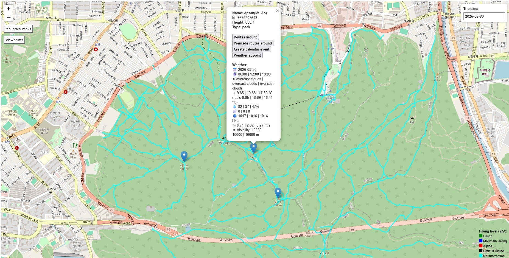
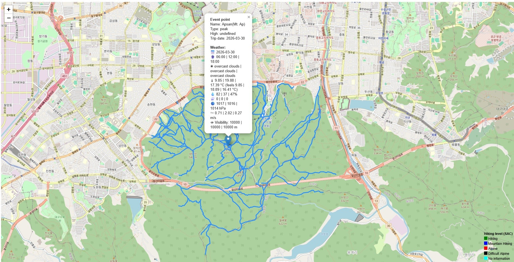
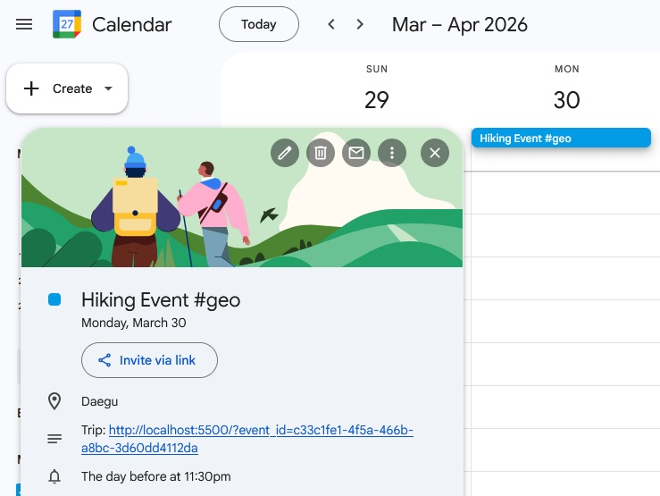

# Geo_project

<p align="center">
    
</p>

# 📍 Geo Project
Aplikacja webowa do planowania wycieczek górskich w Korei Południowej z wykorzystaniem danych z OpenStreetMap.

<details>
<summary>More photos</summary>
<br>
<p align="center">
    <br>
    <br>
</p>
</details>

# 💡 Rozwiązanie
Aplikacja umożliwia:
* przeglądanie mapy Korei Południowej
* pobieranie punktów (szczyty, punkty widokowe) z OpenStreetMap
* wyświetlanie szlaków w promieniu 2 km
* oznaczanie trudności szlaków kolorami
* sprawdzanie prognozy pogody na 5 dni
* zapisywanie wydarzeń w Google Calendar (z linkiem do mapy)

# 🏗 Architektura
Projekt oparty na architekturze wielowarstwowej:
```
Frontend (JavaScript)
    ↓
Backend (FastAPI)
    ↓
Services / Models / External APIs
    ↓
Cache (Redis) → Database (PostgreSQL) → External APIs
```

# Strategia pobierania danych:
1. Cache (Redis)
2. Baza danych (PostgreSQL)
3. Zewnętrzne API (OpenStreetMap/OpenWeatherMap)

# 🐳 Docker
Cała aplikacja działa w kontenerach:
* frontend
* backend
* PostgreSQL
* Redis (cache)
* OpenStreetMap API (lokalnie)

# Funkcjonalności:
* Markery szczytów i punktów widokowych (OpenStreetMap)
* Szlaki górskie wokół wybranego punktu
* Kolorowanie szlaków według trudności
* Prognoza pogody (5 dni)
* Wybór daty wycieczki
* Integracja z Google Calendar (#geo + link do mapy)

# Technologie:
* Python + FastAPI
* PostgreSQL
* Redis (cache)
* Docker / docker-compose
* OpenStreetMap API
* Google Calendar API
* OpenWeatherMap API
* JavaScript (frontend)

# Wzorce i dobre praktyki:
* Dependency Injection
* Retry & timeout dla API
* Healthchecki usług
* Dekoratory (np. do obsługi retry/logiki)
* Podział na warstwy:
    * services
    * models
    * integracje z API

# Testy:
* pytest
* coverage

# Uruchomienie testów:

```bash
pytest
```

# Baza danych:
* PostgreSQL
* Alembic
* dump struktury danych (bez danych) w repo
* cron do usuwania starych/nieaktualnych danych
* dane o:
    * trasach
    * punktach
    * pogodzie
    * wydarzeniach

# Decyzje projektowe:
* Wykorzystanie lokalnych map pozwala na obejście limitów narzuconych przez zewnętrzne API
* OpenWeatherMap zamiast Google Weather API - brak większych ograniczeń API
* Baza danych (PostgreSQL) - zmniejszenie zapytań do API
* Cache (Redis) - trzymanie lokalnej kopii wcelu przyspieszenia odpowiedzi i zmniejszenie liczby zapytań do API
* Docker - łatwe uruchomienie całego środowiska
* Warstwowa architektura - czytelność i skalowalność
* Alembic - kontrola architektury bazy danych między developerami i łatwość testowania zmian

# Google Calendar
Link w wydarzeniu Google Calendar przenosi użytkownika do widoku read-only, który pokazuje szczegóły zaplanowanej wycieczki:

* wybrane szlaki i punkt
* prognozę pogody na dzień wydarzenia
* bez możliwości zmiany daty czy dodawania nowych punktów, aby zachować spójność zaplanowanego terminu i trasy

# Możliwe ulepszenia:
* autoryzacja użytkowników
* CI/CD (deploy)
* lepsze filtrowanie tras

# Uruchomienie:
Ściągnąć mapę korei z: `http://download.geofabrik.de/asia/south-korea.html`.
Przekonwertować mapę z typu `.osm.pbf` na `.osm.bz2` przy użyciu `Osmium`. Przekonwertowaną mapę wrzucić do folderu `docker_db_frontend/overpass_db/`.
Do folderu `geo_project/geo_project/tokens/` wrzucić plik `credentials.json`, który robimy na stronie `https://console.cloud.google.com/`.
W folderze docker_db_frontend:

```bash
docker compose up
```

Kontener z mapą może być uruchamiany pierwszy raz około 20 minut.
Uruchamiamy plik `docker_db_frontend/DB/init/init.sh`.
Przy pierwszej próbie zapisu wydarzenia do kalendarza będzie trzeba się zalogować w przeglądarce do swojego konta google, by dostać plik `token.json`.